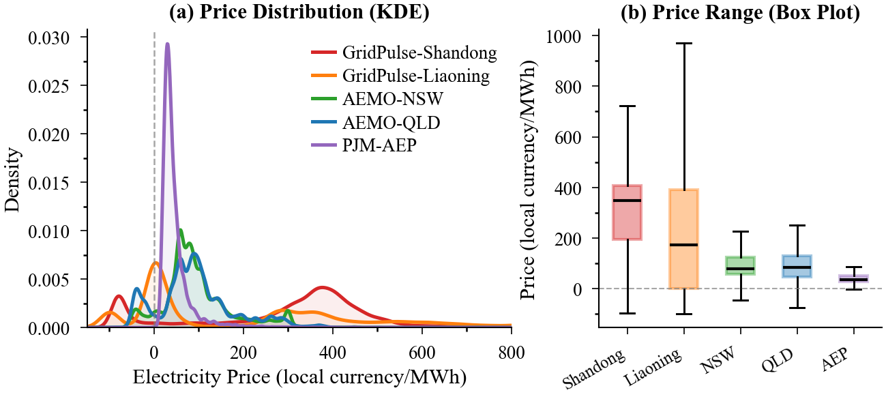

# GridPulse: A Benchmark for Electricity Price Forecasting under Extreme Market Dynamics

## 1. Overview



GridPulse is a challenging benchmark for electricity price forecasting in provincial spot markets. It contains 17,496 hourly observations from two markets with distinct mechanisms, together with 21 temporally aligned covariates and leakage-free preprocessing. Unlike existing public benchmarks that mainly reflect relatively stable market dynamics, GridPulse captures heterogeneous and highly volatile price regimes characterized by frequent negative prices, sharp price spikes, and abrupt regime shifts. It provides a unified evaluation protocol with three bounded, scale-normalized metrics—RSI, QRS, and HARI—and evaluates 11 representative forecasting models under both normal and extreme market conditions. GridPulse also includes PulseDiff as a reproducible baseline, offering a comprehensive testbed for developing robust electricity price forecasting methods in volatile markets.

## 2. Implement

GridPulse requires Python 3.10 or later. Clone the repository and install the required dependencies:

```bash
git clone https://github.com/77-qiqi-wang/GridPulse.git
cd GridPulse

conda create -n gridpulse python=3.10 -y
conda activate gridpulse

pip install -r requirements.txt
```

The training code automatically uses CUDA when a compatible GPU is available; otherwise, it runs on CPU.

Train and evaluate PulseDiff on the dataset:

```bash
# Run on the Liaoning Dataset
python run_liaoning.py

# Run on the Shandong Dataset
python run_shandong.py
```

The results are saved to `outputs_liaoning/` and `outputs_shandong/`, respectively.

## 3. Dataset

GridPulse contains two provincial spot-market datasets collected from Shandong and Liaoning, China. The complete data sources can be accessed through [Google Drive]().

### 3.1 Dataset Overview

The following table provides a brief description of the datasets:

<table>
  <thead>
    <tr>
      <th>Dataset</th>
      <th>Time Range</th>
      <th>Hourly Records</th>
      <th>Valid Price Records</th>
      <th>Auxiliary Variables</th>
      <th>Resolution</th>
      <th>Main Content</th>
    </tr>
  </thead>
  <tbody>
    <tr>
      <td>Shandong</td>
      <td>Jan. 1–Dec. 30, 2025</td>
      <td align="right">8,736</td>
      <td align="right">8,736</td>
      <td rowspan="2" align="right">21</td>
      <td rowspan="2">1 hour</td>
      <td rowspan="2">
        Real-time prices, system load, generation,
        inter-provincial exchange, and weather
      </td>
    </tr>
    <tr>
      <td>Liaoning</td>
      <td>Mar. 1, 2025–Mar. 1, 2026</td>
      <td align="right">8,760</td>
      <td align="right">8,752</td>
    </tr>
  </tbody>
</table>

Together, the two datasets contain 17,496 hourly records and 17,488 valid target-price observations. Each dataset contains 23 named fields: one timestamp, one target real-time price, and 21 temporally aligned auxiliary variables. Shandong contains frequent renewable-driven negative-price events, while Liaoning exhibits stronger volatility, a substantial concentration of zero prices, and heavier positive-price tails.

### 3.2 Fields Description

Most fields share the same definition across the Shandong and Liaoning datasets:

| Field                         | Description                                                  | Unit    |
| ----------------------------- | ------------------------------------------------------------ | ------- |
| `Time`                        | Timestamp of the hourly market record in UTC+8               | —       |
| `Real-time price`             | Hourly real-time electricity settlement price used as the forecasting target | CNY/MWh |
| `Real-time load`              | Real-time electricity demand of the provincial power system  | MW      |
| `Real-time tie-line power`    | Real-time power exchanged through inter-provincial tie lines | MW      |
| `wind output`                 | Real-time wind power generation                              | MW      |
| `Photovoltaic output`         | Real-time photovoltaic power generation                      | MW      |
| `Hydro/pumped-storage output` | Real-time output of hydroelectric and pumped-storage units   | MW      |
| `nuclear output`              | Real-time nuclear power generation                           | MW      |
| `2m air temperature`          | Air temperature measured at 2 metres above the surface       | °C      |
| `2m dew-point temperature`    | Dew-point temperature measured at 2 metres above the surface | °C      |
| `Sea-level pressure`          | Atmospheric pressure adjusted to sea level                   | hPa     |
| `surface pressure`            | Atmospheric pressure at the ground surface                   | hPa     |
| `Total precipitation`         | Total hourly precipitation                                   | mm      |
| `rainfall`                    | Hourly liquid precipitation                                  | mm      |
| `snowfall`                    | Hourly snowfall                                              | cm      |
| `2m relative humidity`        | Relative humidity measured at 2 metres above the surface     | %       |
| `apparent temperature`        | Perceived temperature derived from meteorological conditions | °C      |
| `10m gust speed`              | Maximum wind-gust speed at 10 metres                         | m/s     |
| `10m wind direction`          | Wind direction at 10 metres                                  | degrees |
| `10m wind speed`              | Wind speed at 10 metres                                      | m/s     |
| `100m wind speed`             | Wind speed at 100 metres, reflecting conditions relevant to wind generation | m/s     |

#### 3.2.1 Shandong-Specific Fields

The Shandong dataset contains two additional operation-side variables:

| Field                         | Description                                                | Unit |
| ----------------------------- | ---------------------------------------------------------- | ---- |
| `local generation`            | Real-time output of locally disclosed generation resources | MW   |
| `Total Self-Owned Generation` | Total output of self-owned power-generation units          | MW   |

The Shandong dataset contains 8,736 complete hourly observations. Its real-time prices range from −95.10 to 1,408.15 CNY/MWh, including 1,399 negative-price hours, which account for 16.01% of the target series. These records capture frequent negative prices and abrupt regime changes associated with renewable oversupply and rapid supply–demand rebalancing.

#### 3.2.2 Liaoning-Specific Fields

The Liaoning dataset uses two province-specific generation variables:

| Field                   | Description                                                  | Unit |
| ----------------------- | ------------------------------------------------------------ | ---- |
| `renewable total`       | Total renewable generation disclosed by the provincial market | MW   |
| `non-market generation` | Output from generation resources not participating directly in market clearing | MW   |

The Liaoning dataset contains 8,760 hourly records, of which 8,752 have valid target prices after removing eight sentinel values. It contains 755 negative-price hours and 2,379 zero-price hours, accounting for 8.63% and 27.18% of the valid target series, respectively. Its prices range from −100.00 to 1,500.00 CNY/MWh and exhibit stronger absolute volatility and heavier positive tails than those in Shandong.

## 4. Evaluation Metrics

GridPulse reports three conventional forecasting metrics—MAE, RMSE, and sMAPE—together with three robustness-oriented metrics: RSI, QRS, and HARI. Lower values are better for MAE, RMSE, and sMAPE, whereas higher values are better for RSI, QRS, and HARI.

### 4.1 Robust Scale and Normalized Error

To support scale-independent comparison across markets, the robust metrics use a scale estimated solely from the training targets:

$$\hat{\sigma} = 1.4826 \cdot \text{MAD}\left(\Delta y_{\mathrm{train}}\right),$$

where $\Delta y_{\mathrm{train}}$ denotes the first-order difference series. Given predictions $\hat{y}_i$ and targets $y_i$, the normalized error and normalized log-error are

$$z_i = \frac{|\hat{y}_i-y_i|}{\hat{\sigma}}, \qquad \ell_i = \log(1+z_i).$$

### 4.2 Robust Stability Index

The Robust Stability Index (RSI) evaluates both the typical magnitude and the dispersion of normalized log-errors:

$$\mathrm{RSI} = \frac{1}{1+\text{median}(\boldsymbol{\ell})+\text{MAD}(\boldsymbol{\ell})}.$$

A higher RSI indicates that prediction errors are generally small and stable.

### 4.3 Quantile Robust Score

The Quantile Robust Score (QRS) measures the central tendency and interquartile concentration of normalized log-errors:

$$\mathrm{QRS} = \frac{1}{1+Q_{0.50}(\boldsymbol{\ell})+\left(Q_{0.75}(\boldsymbol{\ell})-Q_{0.25}(\boldsymbol{\ell})\right)}.$$

A higher QRS indicates that errors are more tightly concentrated around a low central value.

### 4.4 Heavy-tail Adjusted Reliability Index

The Heavy-tail Adjusted Reliability Index (HARI) evaluates reliability under large normalized errors without log compression:

$$\mathrm{HARI} = \frac{1}{n}\sum_{i=1}^{n}\frac{1}{1+z_i}.$$

Large errors receive proportionally lower scores, making HARI particularly sensitive to heavy-tail forecasting failures.

RSI, QRS, and HARI are bounded in $(0,1]$ and normalized by the training-set robust scale. They complement conventional metrics from different perspectives: MAE and RMSE measure absolute error magnitude, RSI measures typical-case stability, QRS measures error concentration, and HARI measures tail reliability.

## 5. PulseDiff

PulseDiff is a robust day-ahead electricity price forecasting baseline consisting of three components:

- **Dual-stream encoding:** A 2D CNN encodes the $6\times24$ historical price matrix, while an MLP independently encodes calendar and exogenous covariates. An auxiliary head classifies price regime, trend, and volatility.
- **Dynamic anchor:** Five historical price references are adaptively combined with a bounded correction to produce a stable 24-hour anchor.
- **Residual diffusion:** A confidence-gated diffusion process predicts the normalized residual relative to the anchor using v-prediction and DDIM sampling.

The model is jointly optimized for anchor accuracy, final prediction accuracy, robustness, trajectory shape, diffusion reconstruction, market-state classification, and gate regularization. During inference, multiple stochastic forecasts are averaged to produce the final prediction

## 6. Project Structure

The expected structure of files is:

```text
GridPulse/
├── PulseDiff/
│   ├── __init__.py
│   ├── config.py
│   ├── config_liaoning.yaml
│   ├── config_shandong.yaml
│   ├── data.py
│   ├── model.py
│   └── train_common.py
├── datasets/
│   ├── GridPulse_Liaoning_sample.csv  (replace with the full version)
│   └── GridPulse_Shandong_sample.csv  (replace with the full version)
├── requirements.txt
├── run_liaoning.py
├── run_shandong.py
└── README.md
```